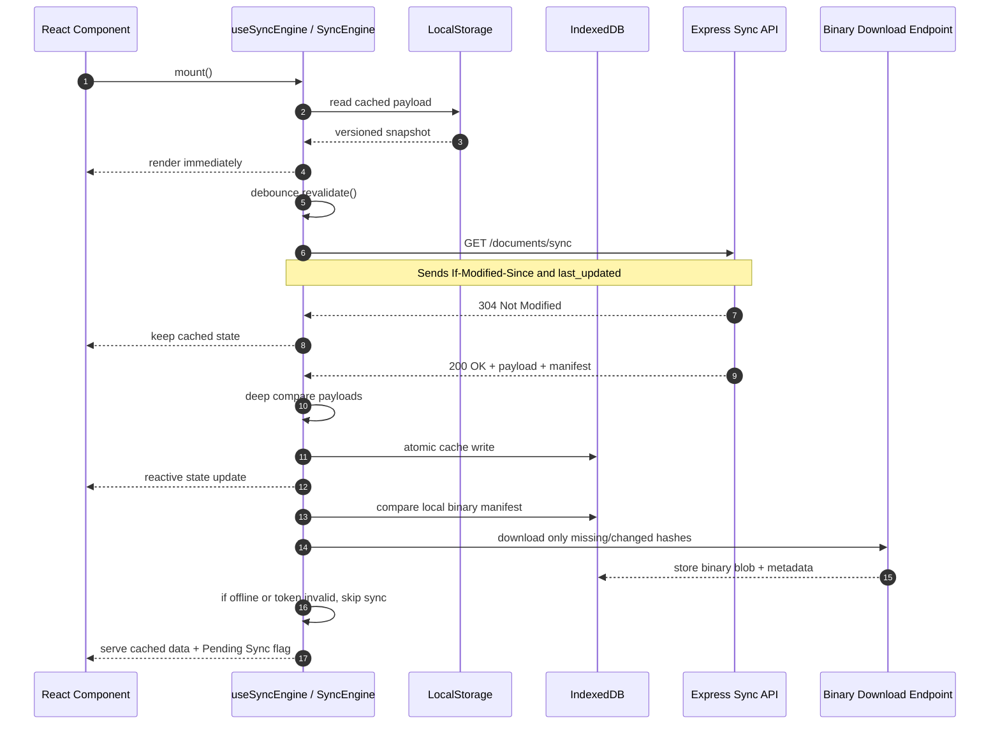

# Advanced SWR Sync Flow

## Flow Notes

1. Small datasets can live in `LocalStorage` with encrypted storage for sensitive payloads.
2. Larger file metadata and binary records are kept in `IndexedDB`.
3. Every cached payload, manifest entry, and pending operation carries `version_id` and `last_updated`.
4. The backend returns `304` when the client version is fresh enough, which avoids unnecessary payload transfer.
5. Binary assets are re-downloaded only when the server hash changes or the local cache is missing.

