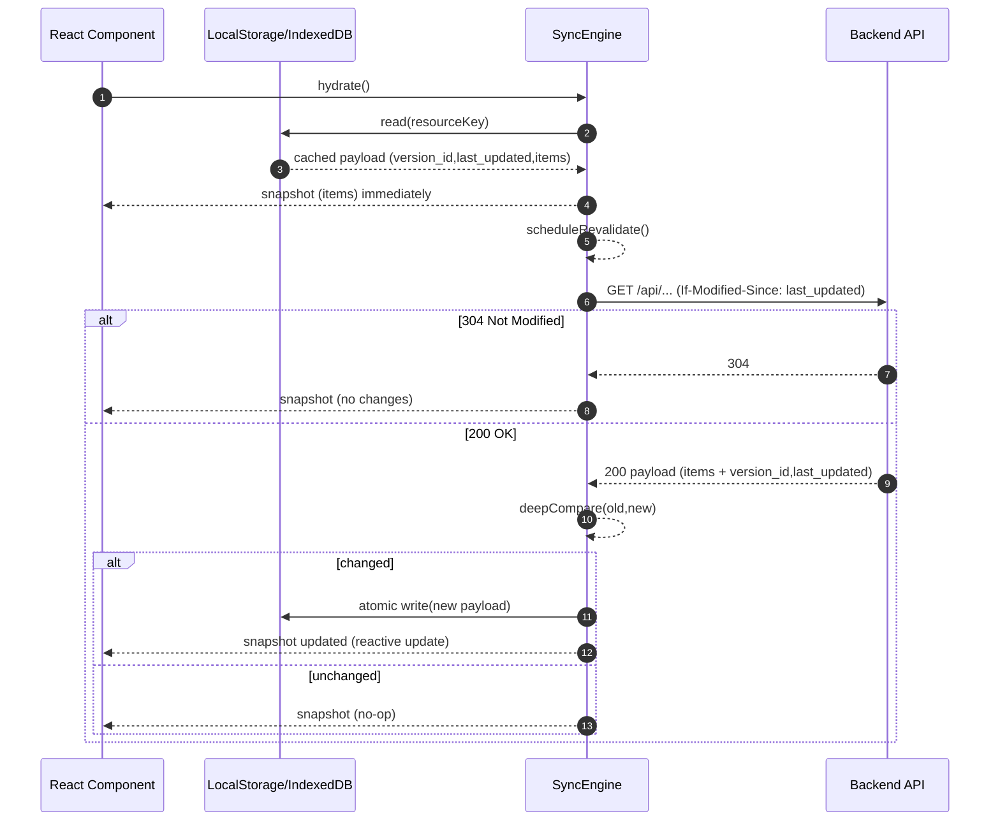

## SWR Sync Engine (Frontend)

This project ships a Stale-While-Revalidate sync engine built around `SyncEngine<T>`:

- **Phase 1 (Optimistic Rendering)**: `hydrate()` reads cached payload from LocalStorage/IndexedDB and immediately updates UI.
- **Phase 2 (Background Validation)**: `revalidate()` runs in the background and sends `If-Modified-Since` using the cached `last_updated`.
- **Phase 3 (Diffing & Patching)**:
  - Backend returns **304** → keep cache, stop.
  - Backend returns **200** with new payload → deep-compare, then write cache + update UI (no full reload).

### Persistence

- **LocalStorage**: small payloads (encrypted when `sensitive: true`).
- **IndexedDB**: larger payloads and binary assets.
- Every cached payload includes: `version_id` + `last_updated`.
- Writes are **atomic** (temp key + commit for LocalStorage, transactions for IndexedDB).

### Offline

- If `navigator.onLine === false`, `revalidate()` exits early and UI keeps working from cache.
- If you also record mutations (pending ops), keep a `pending_sync` flag per item and flush when online.

### Request Debouncing

`scheduleRevalidate()` debounces sync calls during rapid navigation.

---

## Backend contract

Your backend should support conditional GET via standard headers:

- Client sends `If-Modified-Since: <cached last_updated>`
- Server responds:
  - `304 Not Modified` (no body) when up-to-date
  - `200 OK` with payload + version metadata otherwise

The server already has helpers in `server/utils/resourceVersion.ts`:

- `buildResourceVersion()`
- `applyResourceVersionHeaders()`
- `requestMatchesResourceVersion()`

---

## Sequence diagram

